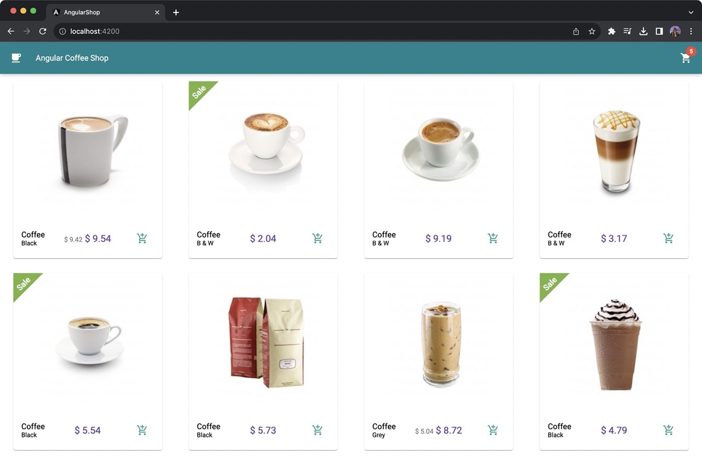
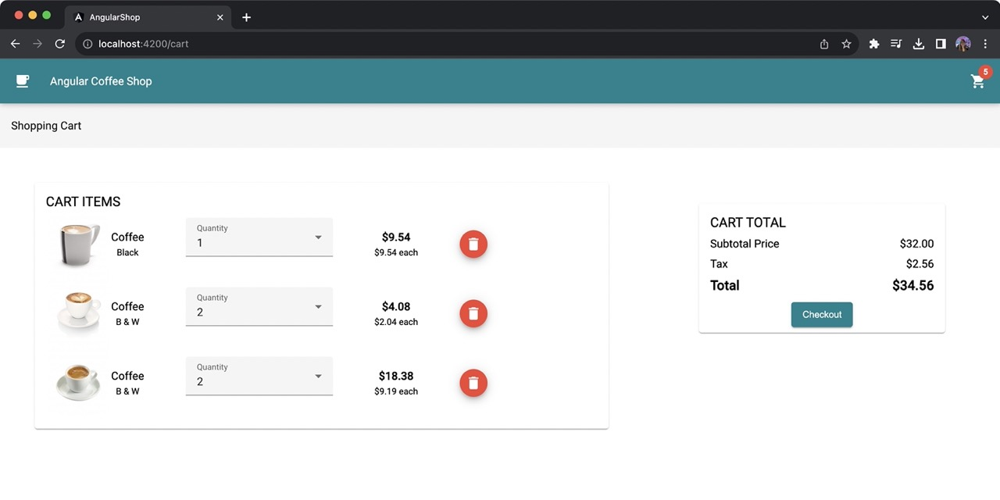

# Angular Shop

Sample project created to showcase the latest Angular features:

- Standalone Components and API (Angular v14 and v15)
- Typed Forms (Angular v14)
- Signals (Angular v16)
- Input Validation (Angular v16)

One of the main ideas of the project is to refactor the old way of creating the project with modules

## ⌨️ Editor / IDE

- Visual Studio Code

## Schematics

- Migrating code from Module to Standalone (3x times with diferent options)
ng generate @angular/core:standalone

- Migrating code to the new Control Flow
ng g @angular/core:control-flow

## Refactoring

- Injects with Services
- Modules and Components to Standalone
- Behavior Subject and Observables to Signals
- Data Binding: Input() and Output()
- New ControlFlow: @NgIf, @NgFor
- Performance: trackBy, Lazy Loading Routing, Imports in each Component
- 

## Screenshots

Main page with products list:

<p align="center">
  
</p>

Cart page:

<p align="center">
  
</p>

## Executing the code locally

You need to have Node.js / NPM installed locally.

1. Install all the required dependencies:

```
npm install
```

2. Execute the project:

```
npm run start
```

This command will run the Angular project with a proxy to the Java server, without requiring CORS.

Open your browser and access **http://localhost:4200** (Angular default port).
